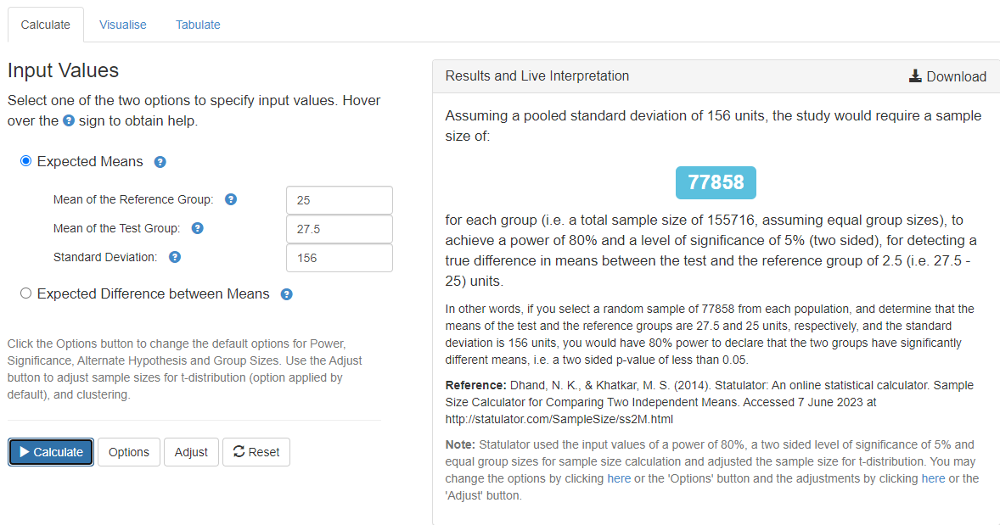
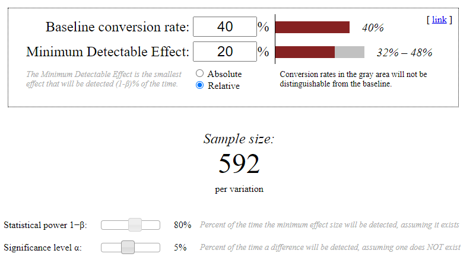

# Урок 6. Расчёт длительности А/B теста + продвинутые топики

## Задание 1
Продакт на главной mail.ru решил протестировать в рекомендательной ленте контента вместо карточек со статьями видеоплеер с короткими видео. Нынешний таймспент на юзера в день в среднем равен 25 минут, а стандартная ошибка (SD) равна 156. Мы предполагаем, что в новой версии таймспент на юзера в день изменится на 10%. Средний трафик 20000 человек в день. Посчитайте сколько дней необходимо держать эксперимент при $\alpha = 5\%$ и $\beta = 20\%$.

Т.к. средний трафик 20000 человек в день, то количество дней эксперимента можно расчитать по формуле: $\cfrac{2 \cdot 77858}{20000} = 7.7858$

**Держать эксперимент необходимо 8 дней.**

***
## Задание 2
Наша продуктовая команда в ecommerce магазине планирует запустить тест, направленный на ускорение загрузки сайта. Одна из основных метрик bounce rate в GA = 40%. Мы предполагаем, что при оптимизации сайта она изменится минимум на 20%. Средний трафик 4000 человек в день. Посчитайте сколько нам нужно дней держать эксперимент при $\alpha = 5\%$ и $\beta = 20\%$.

Нам нужна выборка размером $2 \cdot 592 = 1184$. При трафике в 4000 человек в день **достаточно одного дня эксперимента**.

